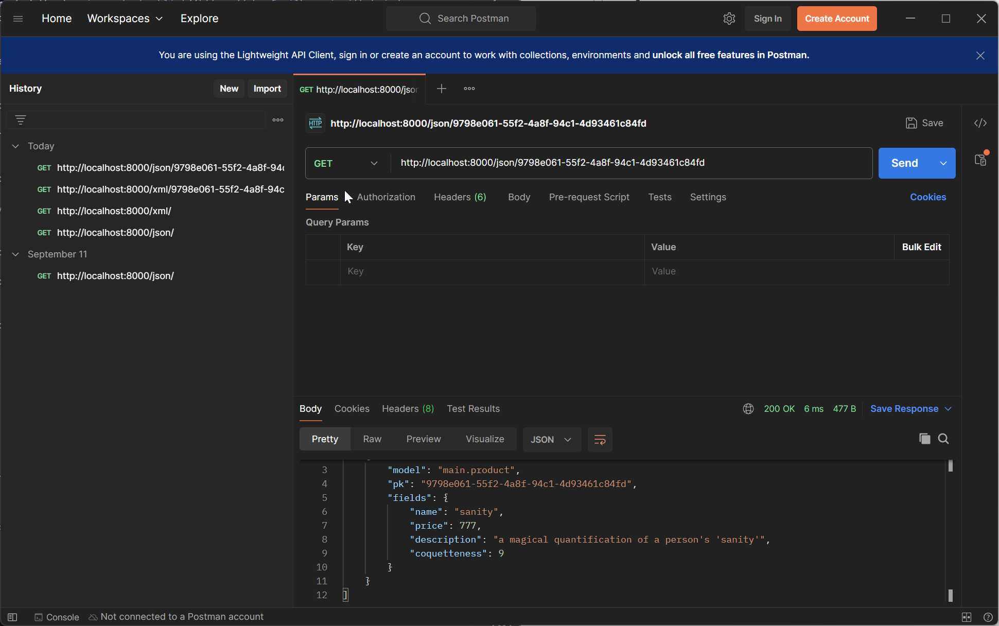
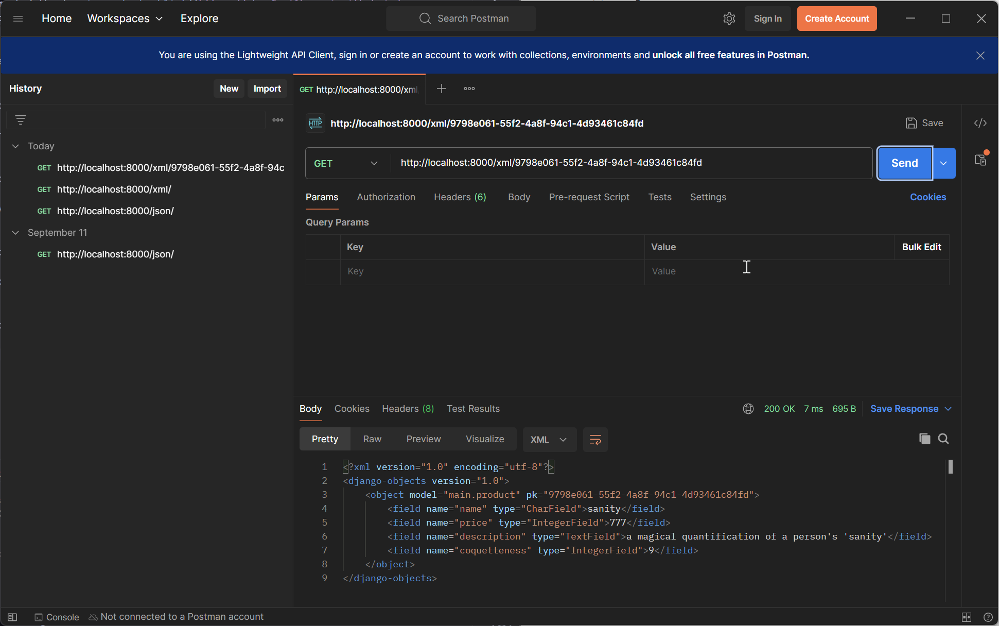
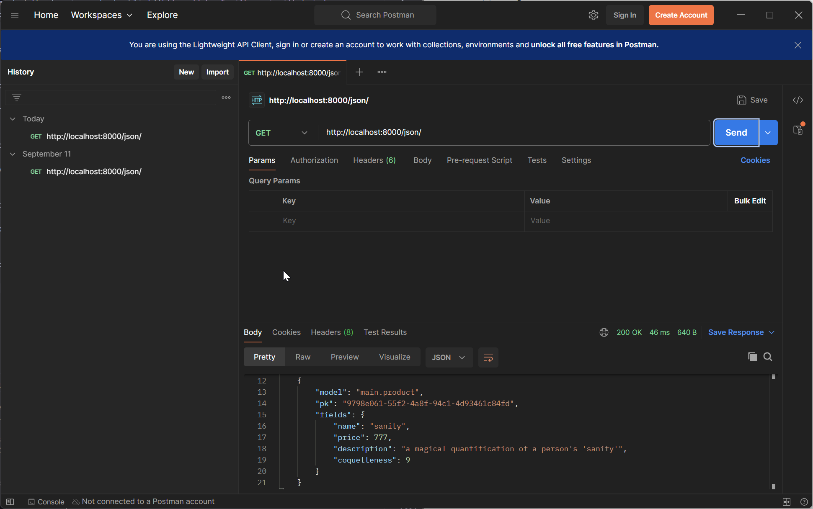

# PWS Deployment URL:
http://isaac-jesse-coquetteshop.pbp.cs.ui.ac.id/


## How I implemented the [assignment checklist](https://pbp-fasilkom-ui.github.io/ganjil-2025/en/assignments/individual/assignment-2)

### Creating a new Django project
First, I created the main directory `coquette_shop` with:
```
mkdir coquette-shop
```

To avoid Python version conflicts and to contain the project, I use a Python virtual environment:
```
python -m venv env
env\Scripts\activate
```

Then, populated a **requirements.txt** file, and then installed them with
```
pip install -r requirements.txt
```

After Django is installed, I initialized the project with
```
django-admin startproject coquette_shop .
```

To test if the project is initialized, I added localhost(127.0.0.1) to the allowed hosts section of `settings.py`, then checked if Django showed the new project screen with

```
python manage.py runserver
```

### Creating an application `main` in the project

To create the 'main' application:
```
python manage.py startapp main
```

### Performing routing in the project so that the application `main` can run
This 'main' app needs to be added to the project directory (coquette_shop, not coquette-shop) settings.py **INSTALLED_APPS** field.

So far, 'main' does not have any html files to display, so I will add one in the templates directory as such:
```
cd main
mkdir templates
nvim main.html
```

I filled the **main.html** file with placeholder fields `{{ application_name }}`, `{{ name }}`, and `{{ class }}` where the 'context' will be supplied by views.py at a later step.

### Creating the Product model in `main` application

Since it was specified that there should be a field `name` with CharField, `price` with IntegerField, and `description` with TextField, I filled `main/models.py` with the following class:

```
from django.db import models


class Product(models.Model):
    name = models.CharField(max_length=255)
    price = models.IntegerField()
    description = models.TextField()
    coquetteness = models.IntegerField()
```

### Creating a function in `views.py` to display the application name , name, and class

Since I already created a template `main.html` with placeholder fields two steps ago, I need to create a function in `main/views.py` that simply shows `main.html` and provides context such as the application name, name, and class:

```
from django.shortcuts import render

def show_main(request):
    context = {
            'application_name': 'coquette-shop',
            'class': 'PBD KKI',
            'name': 'Isaac Jesse Boentoro',
    }
    return render(request, "main.html", context)
```

### Routing the `show_main` function in `views.py` to `urls.py`

I added ` path('', include('main.urls'))` to the `urlpatterns` field in `coquette-shop/urls.py` and
```
from django.urls import path
from main.views import show_main

app_name = 'main'
urlpatterns = [
        path('', show_main, name = 'show_main'),
]
```
to `main/urls.py`

### Performing deployment to PWS

I created a PWS project named coquetteshop, added `isaac-jesse-coquetteshop.pbp.cs.ui.ac.id` to `ALLOWED_HOSTS` in settings.py, then added it as remote and pushed it to PWS.

## Diagram explaining flow from Client request to `urls.py`, `views.py`, `models.py`, and the `html` file


## The use of `git` in software development

git is extremely useful for software developers to be able to track their changes, revert to previous versions of their project if need be, and allows developers to store their projects in remote repositories such as Github or Gitlab, making it possible to collaborate with others easily.

## Why is Django used as the starting point for learning software development?

In my opinion, Django is fairly straightforward to setup, and has an inherent user-friendly syntax because it is built on Python.

## Why is Django called an ORM?

Django is called an ORM because it maps entries in a database to objects in the object oriented programming language (namely, Python). Django in particular does this through the `models.py` file.

## Why do we need Data delivery in implementing a platform?

Data delivery is useful to enable asynchronous communication between users of the platform, or between the administrator of the platform and its users. Platforms cannot function effectively as just a static site.

## JSON or XML?
In my opinion, JSON is simply superior. JSON is also more widely used for some reasons such as not needing a dedicated parser, shorter, and not needing closing tags.

## Explaining `is_valid()`
is_valid() is used to validate the user input before saving it to the database. It is not guaranteed that site users will submit the correct format of data, then it is crucial to make sure that the form input is valid before being submitted to the database, potentially preventing errors down the line.

## CSRF Token 
CSRF Tokens are a hidden field that makes sure that the connection between the user's web browser is valid with the website. This prevents Cross-Site Request Forgery attacks, where a malicious website tricks a user's browser into falsely performing actions on another website where they are already authenticated. Without this, it is possible for the user's web browser to be manipulated and submit data to the Django form without their consent.

## How I implemented the [assignment checklist](https://pbp-fasilkom-ui.github.io/ganjil-2025/en/assignments/individual/assignment-3)

### Setting up base template
To avoid code repetition and ease extending the site template, I created a template directory in the root directory and created `base.html`.

To reflect these changes, I then added BASE_DIR / 'templates' in settings.py to the DjangoTemplates DIR field.

### Creating forms
In the 'main' application folder, I created `forms.py` which uses the previously created `Product` model in `models.py`.

```
from django.forms import ModelForm
from main.models import Product

class ProductEntryForm(ModelForm):
    class Meta:
        model = Product
        fields = ["name", "price", "description", "coquetteness"]

```

To correctly identify each `Product` model, I added a UUID to the model as such:

```
class Product(modelsModel):
    ...
   id = models.UUIDField(primary_key = True, default=uuid.uuid4, editable=False)
   ...
```

### Creating the HTML field to use the form
Using codeblocks, I created `create_product.html` that uses the form created earlier, and then displayed the stored models in `main.html` by returning all Products in `views.py` as context.

`create_product.html`
```
 

<h1>Add Product</h1>

<form method="POST">
  
  <table>
    {{ form.as_table }}
    <tr>
      <td></td>
      <td> 
        <input type="submit" value="Add Product" />
      </td>
    </tr>
  </table>
</form>


```

`main.html`

```

<p>There are no producs.</p>

<table>
  <tr>
    <th>Product Name</th>
    <th>Price</th>
    <th>Description</th>
    <th>Coquetteness</th>
  </tr>

   This is how to display Product data
   
  
  <tr>
    <td>{{product.name}}</td>
    <td>{{product.price}}</td>
    <td>{{product.description}}</td>
    <td>{{product.coquetteness}}</td>
  </tr>
  
</table>


<br />

<a href="">
  <button>Add New Product</button>
</a>

```

`views.py`
```
def show_main(request):
    ...
    return render(request, "main.html", context)
        products = Product.objects.all()
    ...
```
Then, added the actual form to `views.py` and implemented input validation.
`views.py`
```
def create_product(request):
       form = ProductEntryForm(request.POST or None)
       if form.is_valid() and request.method == "POST":
              form.save()
              return redirect('main:show_main')
       context = {'form': form}
       return render(request, "create_product.html", context)
```


### To access the XML and JSON data from the forms directly, I created 4 functions  (show_json, show_xml, show_json_by_id, show_xml_by_id)

`views.py`

```

def show_xml(request):
        data = Product.objects.all()
        return HttpResponse(serializers.serialize("xml", data), content_type="application/xml")

def show_json(request):
        data = Product.objects.all()
        return HttpResponse(serializers.serialize("json", data), content_type="application/json")

def show_xml_by_id(request, id):
        data = Product.objects.filter(pk=id)
        return HttpResponse(serializers.serialize("xml", data), content_type="application/xml")

def show_json_by_id(request, id):
        data = Product.objects.filter(pk=id)
        return HttpResponse(serializers.serialize("json", data), content_type="application/json")
```

## Using Postman to test GET requests:




