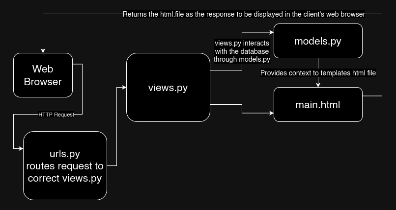

# PWS Deployment URL:
http://isaac-jesse-coquetteshop.pbp.cs.ui.ac.id/


## How I implemented the [assignment checklist](https://pbp-fasilkom-ui.github.io/ganjil-2025/en/assignments/individual/assignment-2)

### Creating a new Django project
First, I created the main directory `coquette_shop` with:
```
mkdir coquette-shop
```

To avoid Python version conflicts and to contain the project, we use a Python virtual environment:
```
python -m venv env
env\Scripts\activate
```

Then, populated a **requirements.txt** file, and then installed them with
```
pip install -r requirements.txt
```

After Django is installed, I initialized the project with
```
django-admin startproject coquette_shop .
```

To test if the project is initialized, I added localhost(127.0.0.1) to the allowed hosts section of `settings.py`, then checked if Django showed the new project screen with

```
python manage.py runserver
```

### Creating an application `main` in the project

To create the 'main' application:
```
python manage.py startapp main
```

### Performing routing in the project so that the application `main` can run
This 'main' app needs to be added to the project directory (coquette_shop, not coquette-shop) settings.py **INSTALLED_APPS** field.

So far, 'main' does not have any html files to display, so we will add one in the templates directory as such:
```
cd main
mkdir templates
nvim main.html
```

I filled the **main.html** file with placeholder fields `{{ application_name }}`, `{{ name }}`, and `{{ class }}` where the 'context' will be supplied by views.py at a later step.

### Creating the Product model in `main` application

Since it was specified that there should be a field `name` with CharField, `price` with IntegerField, and `description` with TextField, I filled `main/models.py` with the following class:

```
from django.db import models


class Product(models.Model):
    name = models.CharField(max_length=255)
    price = models.IntegerField()
    description = models.TextField()
    coquetteness = models.IntegerField()
```

### Creating a function in `views.py` to display the application name , name, and class

Since I already created a template `main.html` with placeholder fields two steps ago, I need to create a function in `main/views.py` that simply shows `main.html` and provides context such as the application name, name, and class:

```
from django.shortcuts import render

def show_main(request):
    context = {
            'application_name': 'coquette-shop',
            'class': 'PBD KKI',
            'name': 'Isaac Jesse Boentoro',
    }
    return render(request, "main.html", context)
```

### Routing the `show_main` function in `views.py` to `urls.py`

I added ` path('', include('main.urls'))` to the `urlpatterns` field in `coquette-shop/urls.py` and
```
from django.urls import path
from main.views import show_main

app_name = 'main'
urlpatterns = [
        path('', show_main, name = 'show_main'),
]
```
to `main/urls.py`

### Performing deployment to PWS

I created a PWS project named coquetteshop, added `isaac-jesse-coquetteshop.pbp.cs.ui.ac.id` to `ALLOWED_HOSTS` in settings.py, then added it as remote and pushed it to PWS.

## Diagram explaining flow from Client request to `urls.py`, `views.py`, `models.py`, and the `html` file



## The use of `git` in software development

git is extremely useful for software developers to be able to track their changes, revert to previous versions of their project if need be, and allows developers to store their projects in remote repositories such as Github or Gitlab, making it possible to collaborate with others easily.

## Why is Django used as the starting point for learning software development?

In my opinion, Django is fairly straightforward to setup, and has an inherent user-friendly syntax because it is built on Python.

## Why is Django called an ORM?

Django is called an ORM because it maps entries in a database to objects in the object oriented programming language (namely, Python). Django in particular does this through the `models.py` file.


